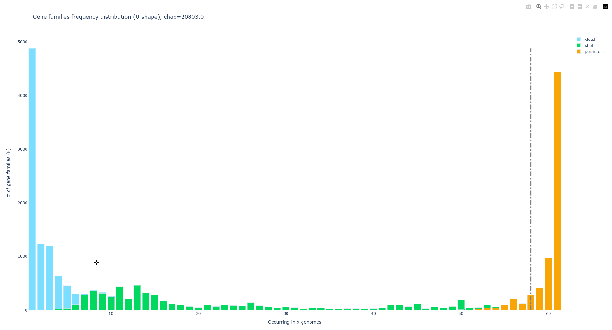

# Build and partition a pangenome graph

## How to build and partition a pangenome graph in one command line with PPanGGOLiN

Now that you have your list of genome as described [here](./inputData#create-your-list-of-genomes-file) you can build the pangenome of _B.japonicum_. 

We tried to make PPanGGOLiN relatively easy to use by making this **'workflow'** subcommand. 
It runs a pangenome analysis whose exact steps will depend on the input files you provide it with. 
In the end, you will end up with some files and figures that describe the pangenome of your taxonomic group of interest in different ways.

The minimal subcommand is as follows :
 
```
ppanggolin workflow --anno organism_gbff.list -o B_janonicum_results
```

Congratulation, you build (maybe your first) pangenome graph and partitioned it in 3 different partition: **persistent**, **shell** and **cloud** (look at ([Gautreau et al. 2020](https://doi.org/10.1371/journal.pcbi.1007732)) for more information about partition)

The results of the workflow is saved in the  **pangenome.h5** file, which is in the HDF-5 file format.
When you run an analysis using this file as input, the results of that analysis will be added to the file to supplement the data that are already stored in it. 
The idea behind this is that you can store and manipulate your pangenome with PPanGGOLiN by using this file only. It will keep all the information about what was done, all the parameters used, and all the pangenome's content.


```{tip}
Many option are available to tune your analysis. Take a look here.
```

## PPanGGOLiN output available on the pangenome graph
```{note}
All the outputs available are not going to be describe here.
To look at all PPanGGOLiN outputs go here.
```

The workflow subcommand generate automatically some outputs, we are going to describe some of them that are useful and classic in pangenome analyses

### U-shaped plot:  gene families frequency distribution in pangenome

A U-shaped plot is a figure presenting the number of families (y-axis) per number of organisms (x-axis). 
It is a .html file that can be opened with any browser and with which you can interact, zoom, move around, 
mouseover to see numbers in more detail, and you can save what you are seeing as a .png image file.



A dotted grey bar on the graph representing the **soft core threshold** which is the lower limit for which families are present in the majority of genomes. By default this value is 95% (so families are in more than 95 genomes). 

You can change this value as such:

``` 
ppanggolin draw -p pangenome.h5 -o . --ucurve --soft_core 0.8 -f
```

### Tile plot: detect pangenome structure and outlier
A tile plot is a heatmap representing the gene families (y axis) in the organisms (x axis) making up your pangenome. 
The tiles on the graph will be colored if the gene family is present in an organism and uncolored if absent. 
The gene families are ordered by partition, and the genomes are ordered by a hierarchical clustering based on their shared gene families (basically two genomes that are close together in terms of gene family composition will be close together on the figure).

This plot is quite helpful to observe potential structures in your pangenome, and can also help you to identify eventual outliers.
You can interact with it, and mousing over a tile in the plot will indicate to you which is the gene identifier(s),
the gene family and the organism that corresponds to the tile.


[//]: # (Explain the bar on the right side)

If you do not want the 'cloud' gene families as it is a lot of data and can be hard to open with a browser sometimes,
you can use the following option:

`ppanggolin draw -p pangenome.h5 --tile_plot --nocloud`

```{note}
If you build your pangenome using the 'workflow' subcommand and you have more than 500 organisms, only the 'shell' and the 'persistent' partitions will be drawn, leaving out the 'cloud' as the figure tends to be too heavy for a browser to open it otherwise.
```

### Rarefaction curve: indicator of the taxonomic group diversity

The rarefaction curve represents the evolution of the number of gene families for each partition as you add more genomes to the pangenome.
It has been used a lot in the literature as an indicator of the diversity that you are missing with your dataset on your taxonomic group.
The idea is that if at some point when you keep adding genomes to your pangenome you do not add any more gene families,
you might have access to your entire taxonomic group's diversity.
On the contrary if you are still adding a lot of genes you may be still missing a lot of gene families.

There are 8 partitions represented. For each of the partitions there are multiple representations of the observed data.
You can find the observed: *means*, *medians*, *1st* and *3rd quartiles* of the number of gene families per number of genome used. 
And you can find the *fitting* of the data by the **Heaps' law**, which is usually used to represent this evolution of the diversity in terms of gene families in each of the partitions.

It can be generated using the 'rarefaction' subcommand, which is dedicated to drawing this graph, as such :

`ppanggolin rarefaction -p pangenome.h5`

A lot of options can be used with this subcommand to tune your rarefaction curves, look at the documentation here.