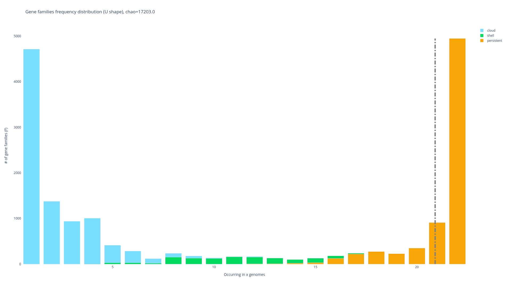
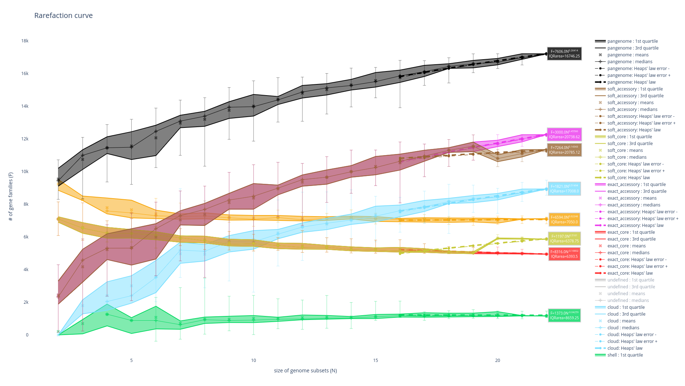
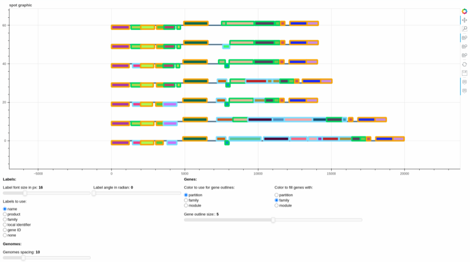

### Pangenome figures output

#### U-shape plot
A U-shaped plot is a figure showing the number of families (y-axis) per number of genomes (x-axis). The grey dashed vertical line represents the threshold used to define the soft_core.
It is a .html file that can be opened with any browser and with which you can interact, zoom, move around, mouseover to see numbers in more detail, and you can save what you see as a .png image file.

It can be generated using the `draw` subcommand as such : 

```bash
ppanggolin draw -p pangenome.h5 --ucurve
```





#### Tile plot

A tile plot is similar to a heatmap representing the gene families (y-axis) in the genomes (x-axis) making up your pangenome. The tiles on the graph will be colored if the gene family is present in a genome (the color depends on the number of gene copies) and uncolored if absent. The gene families are ordered by partition and then by a hierarchical clustering, and the genomes are ordered by a hierarchical clustering based on their shared gene families (basically two genomes that are close together in terms of gene family composition will be close together on the figure).

This plot is quite helpful to observe potential structures in your pangenome, and can help you identify eventual outliers. You can interact with it, and mousing over a tile in the plot will indicate to you the gene identifier(s), the gene family and the genome corresponding to the tile.

If you build your pangenome using a workflow subcommands (`all`, `workflow`, `panrgp`, `panmodule`) and you have more than 500 genomes, only the 'shell' and the 'persistent' partitions will be drawn, leaving out the 'cloud' as the figure tends to be too heavy for a browser to open it otherwise.

It can be generated using the 'draw' subcommand as such : 

```bash
ppanggolin draw -p pangenome.h5 --tile_plot
```


and if you do not want the 'cloud' gene families as it is a lot of data and can be hard to open with a browser sometimes, you can use the following option : 

```bash
ppanggolin draw -p pangenome.h5 --tile_plot --nocloud
```

#### Rarefaction curve
This figure is not drawn by default in the 'workflow' subcommand as it requires a lot of computations. It represents the evolution of the number of gene families for each partition as you add more genomes to the pangenome. It has been used a lot in the literature as an indicator of the diversity that you are missing with your dataset on your taxonomic group (Tettelin et al., 2005). The idea is that if at some point when you keep adding genomes to your pangenome you do not add any more gene families, you might have access to your entire taxonomic group's diversity. On the contrary, if you are still adding a lot of genes you may be still missing a lot of gene families. 

There are 8 partitions represented. For each of the partitions, there are multiple representations of the observed data. You can find the observed means, medians, 1st and 3rd quartiles of the number of gene families per number of genome used. You can also find the best fitting of the data by the Heaps' law, which is usually used to represent this evolution of the diversity in terms of gene families in each of the partitions.

It can be generated using the 'rarefaction' subcommand, which is dedicated to drawing this graph, as such : 

```bash
ppanggolin rarefaction -p pangenome.h5
```




A lot of options can be used with this subcommand to tune your rarefaction curves, most of them are the same as with the `partition` workflow.
The following 3 are related to the rarefaction alone:

- `--depth` defines the number of sampling for each number of genomes (default 30)
- `--min` defines the minimal number of genomes in a sample (default 1)
- `--max` defines the maximal number of genomes in a sample (default 100)

So for example the following command:

```bash
ppanggolin rarefaction -p pangenome.h5 --min 5 --max 50 --depth 30
```

Will draw a rarefaction curve with sample sizes between 5 and 50 (between 5 and 50 genomes will be used), and with 30 samples at each point (so 30 samples of 5 genomes, 30 samples or 6 genomes ... up to 50 genomes).


#### Spot plots

The 'draw' command can draw specific spots of interest, whose ID are provided, or all the spots if you wish.
It will also write a graph file in GEXF format, which corresponds to the gene families and their organization within the spots. It is basically a subgraph of the pangenome, consisting of the spot itself.

The command can be utilized as follows:

- To generate an interactive .html figure and a corresponding gexf file for all spots:
```bash
ppanggolin draw -p pangenome.h5 --draw_spots --spots all
```

- If your focus is on a particular spot, you can utilize its identifier to draw it. For example, to draw spot_34:
```bash
ppanggolin draw -p pangenome.h5 --draw_spots --spots spot_34 
```


The interactive figures that are drawn look like this:




The plot represents the different gene organizations that are found in the spot. If there are RGPs with identical gene organization, the organization is represented only once (the represented RGP is picked at random among all identical RGPs). The list of RGPs with the same organization is accessible in the file written alongside the figure called 'spot_X_identical_rgps.tsv', with X the spot_id.

They can be edited using the sliders and the radio buttons, to change various graphical parameters, and then the plot itself can be saved using the save button on the right of the screen, if need be.

For the gexf file, you can see how to visualize it in the section about the [pangenome gexf](./pangenomeGraphOut.md#pangenome-graph-output).
