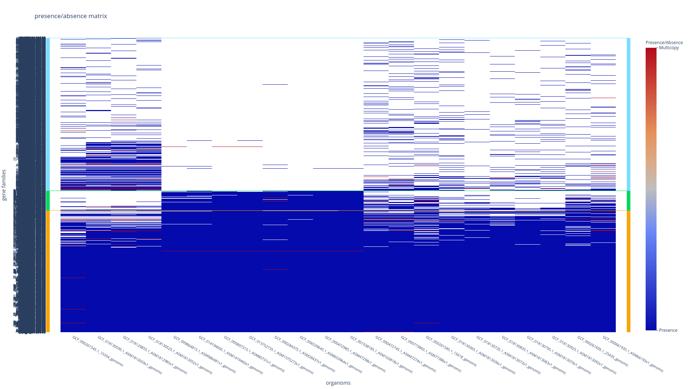

## Usual pangenome outputs

The complete workflow subcommand `all` automatically generates some files and figures. 
Here, we are going to describe several of these key outputs that are commonly used in pangenomic studies as these files illustrate the pangenome in different ways.

### Statistics and metrics on the pangenome
#### Statistics about genomes

PPanGGOLiN generates a tab-separated file called `genome_statistics.tsv` describing the content of each genome used for building the pangenome.
It might be useful when working with fragmented data such as *MAGs* or in cases where there is a suspicion that some genomes might be chimeric or fall outside the intended taxonomic group (as those genomes will be outliers regarding the numbers in this file).
The first lines starting with a '#' are indicators of parameters used when generating the numbers describing each genome, and should not be included when loading the file into a spreadsheet. However, if you load this file using R, these lines will be automatically skipped

This file is described in the documentation [here](../PangenomeAnalyses/pangenomeStat.md#genome-statistics-table).

```{note}
This command will also generate the 'mean_persistent_duplication.tsv' file.
```

#### Gene presence absence

PPanGGOLiN generates presence absence matrix of genomes and gene families. This format mirrors the structure of the `gene_presence_absence.Rtab` file obtained from the pangenome analysis software [Roary](https://sanger-pathogens.github.io/Roary/).

More information about this file can be found [here](../PangenomeAnalyses/pangenomeStat.md#gene-presence-absence-matrix)


#### mean persistent duplication

PPanGGOLiN generates a TSV file called `mean_persistent_duplication.tsv`. This file lists the gene families along with their duplication ratios, average presence in the pangenome, and classification as 'single copy markers'. 

More information about this file can be found [here](../PangenomeAnalyses/pangenomeStat.md#mean-persistent-duplication)


### Figures
#### U-shaped plot:  gene families frequency distribution in pangenome

A U-shaped plot is a figure presenting the number of families (y-axis) per number of genomes (x-axis). 
It is a _.html_ file that can be opened with any browser and with which you can interact, zoom, move around, 
mouseover to see numbers in more detail, and you can save what you are seeing as a .png image file.


A dotted grey bar on the graph represents the **soft core threshold** which is the lower limit for which families are present in the majority of genomes. By default, this value is 95% (so families are in more than 95 genomes).
Look at [here](../PangenomeAnalyses/pangenomeAnalyses.md#u-shape-plot) to change the default parameters.


#### Tile plot: detect pangenome structure and outlier

A tile plot is a heatmap representing the gene families (y-axis) in the genomes (x-axis) making up your pangenome. 
The tiles on the graph will be colored if the gene family is present in a genome and uncolored if absent. 
The gene families are ordered by partition, and the genomes are ordered by a hierarchical clustering based on their shared gene families (basically two genomes that are close together in terms of gene family composition will be close together on the figure).

This plot is quite helpful to observe potential structures in your pangenome, and can also help you to identify eventual outliers.
You can interact with it, and mousing over a tile in the plot will indicate to you which is the gene identifier(s),
the gene family and the genome that corresponds to the tile.



[//]: # (TODO Explain the bar on the right side)

With the 'workflow' subcommand, if you have more than 500 genomes, only the 'shell' and the 'persistent' partitions will be drawn, leaving out the 'cloud' as the figure tends to be too heavy for a browser to open it otherwise. Look at [here](../PangenomeAnalyses/pangenomeAnalyses.md#tile-plot) to add the cloud if you need.

```{note}
If you want the 'cloud' gene families even if a lot of data can be hard to open with a browser sometimes,
you can generate the tile plot as explain [here](../PangenomeAnalyses/pangenomeFigures.md#tile-plot)
```

#### Rarefaction curve: an indicator of the taxonomic group diversity

```{note}
The rarefaction curve is not drawn by default in the 'workflow' subcommand as it requires heavy computation. 
To compute it add the option `--rarefaction` to the subcommand or look at [here](../PangenomeAnalyses/pangenomeFigures.md#rarefaction-curve) for more information. 
```
The rarefaction curve represents the evolution of the number of gene families for each partition as you add more genomes to the pangenome.
It has been used a lot in the literature as an indicator of the diversity that you are missing with your dataset on your taxonomic group.
The idea is that if at some point when you keep adding genomes to your pangenome you do not add any more gene families,
you might have access to your entire taxonomic group's diversity.
On the contrary, if you are still adding a lot of genes you may be still missing a lot of gene families.

There are 8 partitions represented. For each of the partitions, there are multiple representations of the observed data.
You can find the observed: *means*, *medians*, *1st* and *3rd quartiles* of the number of gene families per number of genomes used. 
And you can find the *fitting* of the data by the **Heaps' law**, which is usually used to represent this evolution of the diversity in terms of gene families in each of the partitions.

### pangenomeGraph files
The pangenome's graph can be given through multiple data formats, in order to manipulate it with other software.
All the formats provided by PPanGGOLiN are describe [here](../PangenomeAnalyses/pangenomeAnalyses.md#pangenome-graph-output)


The Graph can be given through the _light.gexf files that contain the gene families as nodes and the edges between gene families describing their relationship. He is not exhaustive, but he is easier to manipulate and for most of the users, the information in it is enough.

```{note}
They can be manipulated and visualised through a software called [Gephi](https://gephi.org/). 
Find more information on how to use Gephi [here](../PangenomeAnalyses/pangenomeGraph.md#gephi)
```

